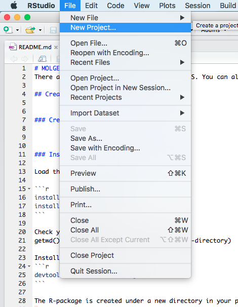
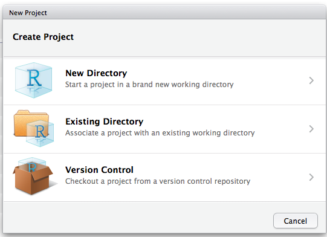
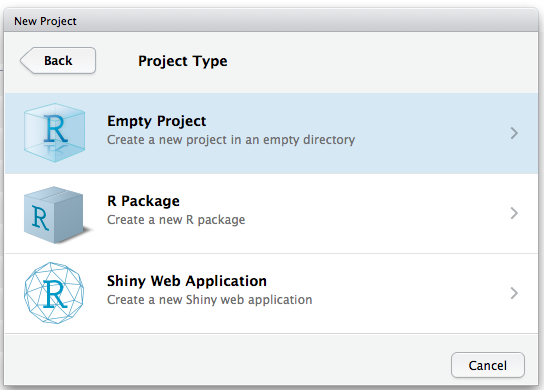
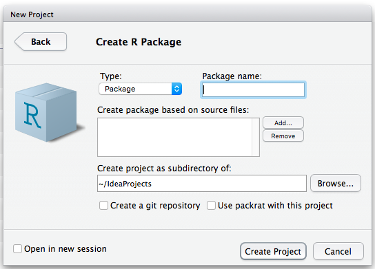
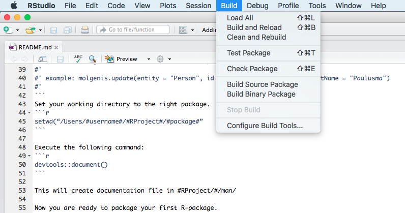
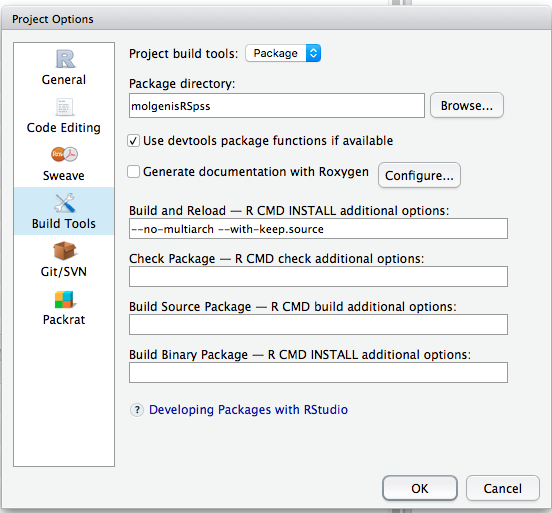
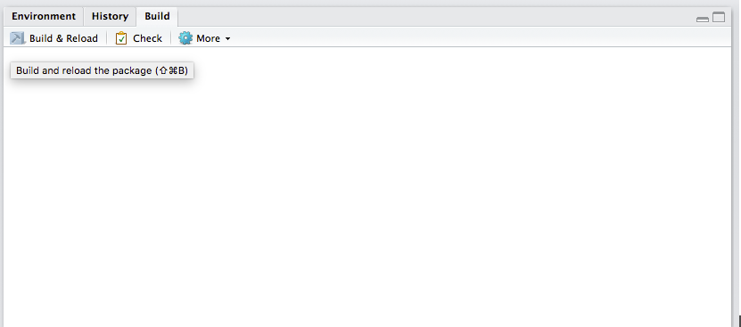

# MOLGENIS R development
This will help you setup R-Studio to create a new R-pacakge and release it on CRAN.

There are a number of R-clients for MOLGENIS. You can also develop clients yourself.

## Creating MOLGENIS R-packages
To create a new R-package in R-Studio you need to follow the guidelines below.

- Click on "File --> New project"



- Choose a location for your project --> "New directory"



- Choose the kind of project --> "Create a new package"



- Configure the package which you want to build



- Install DEV-tools

```r
install.packages("devtools")
install.packages("roxygen2")
```

### Create documentation

Add documentation to your .R files. Example documentation is shown below.

```r
#' Updates an existing entity
#'
#' @param entity the entityname
#' @param id the id of the entity to update
#'   ...: var arg list of attribute name/value pairs
#'
#' @examples: molgenis.update(entity = "Person", id = 5, firstName = "Piet", lastName = "Paulusma")
#'
#' @return an entity
#' 
#' @importFrom httr POST (document the methods for release purposes)
#'
#' @export (make it a public method, usable for the end-user) 
#'
```

Execute the following command:
```r 
devtools::document()
```

This will create documentation file in #RProject/#/man/

Now you are ready to build your first R-package.

### Build a package
R-Studio is used to build the packages. 

Configure the "Build tools".



Assign a working directory (#RPackage#)



Click on "Build and reload" on the right side of the screen




### Installing the package
You can install the R-package via Github when you have loaded the devtools-package (see above). Just run:

```r
install_github("#username#/#repo#")
```

**Example:**

```r
install_github("sidohaakma/molgenis-client-r-spss")
```

### Setup version control
Add for all R-packages remote repositories on Github.

Use ```git init``` in R-packages and add the remote repositories ```git remote add origin https://github.com/#name#/#RPackage#```.

## Releasing an R-package

To release you have to make sure all warnings are removed during the build.

### Set right locale 
Sometimes the locale is not set correctly in R-Studio. You can set is right by setting an environment variable in the console.

- Enter in your R-terminal

```r
Sys.setenv(TZ="Europe/Amsterdam")
```

This will prevent this warning:

```r
Warning in as.POSIXlt.POSIXct(x, tz) : unknown timezone 'zone/tz/2017c.1.0/zoneinfo/Europe/Amsterdam'
```

### Set the right encoding
Sometimes the encoding of R-Studio is not set correctly. You can set this right by toggle a setting in the "Global settings". 

Go to "Tools --> Global options"


Go to "Code --> Saving"


Set UTF-8 in encoding field. This will prevent

```
Warning messages: 
  Setting LC_CTYPE failed, using "C" 
  Setting LC_COLLATE failed, using "C" 
  Setting LC_TIME failed, using "C" 
  Setting LC_MESSAGES failed, using "C" 
  Setting LC_MONETARY failed, using "C" 
```

### Expose use methods in NAMESPACE
To get rid of NOTE's in the "check-phase" of the build you have to add exposure tags in the documentation. You can do this by adding:

```r
@importFrom #package# #method1# #method2# #method3# #method4#
@importFrom #package# #method5# #method6# etc..
```

You can add upto 4 methods per line. Then run ```devtools::document()``` to write the new NAMESPACE-file.